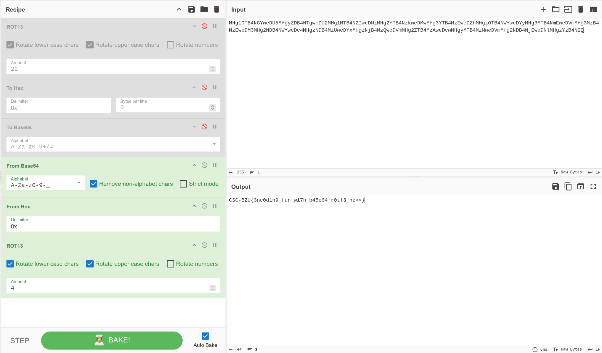

# 🧬 Power lies in multi-layered encoding

## 🧩 Given Information:

- The power lies in **multi-layered encoding**.
- **[File](../content/MHg1OTB4NGYweDU5MHgyZDB4NTgweDU2MHg1MTB4N2IweDMzMHg2YTB4NzkweDMwMHg3YTB4MzEweDZhMHgzOTB4NWYweDYyMHg3MTB4NmEweDVmMHg3MzB4MzEweDM3MHg2NDB4NWYweDc4MHgzNDB4MzUweDYxMHgzNjB4MzQweDVmMHg2ZTB4MzAweDcwMHgyMTB4MzMweDVmMHg2NDB4NjEweDNlMHgzYzB4N2Q.txt)**

---

## 🔍 Step 1: Decode the File Name

### 🔡 Encoded Filename:

```
MHg1OTB4NGYweDU5MHgyZDB4NTgweDU2MHg1MTB4N2IweDMzMHg2YTB4NzkweDMwMHg3YTB4MzEweDZhMHgzOTB4NWYweDYyMHg3MTB4NmEweDVmMHg3MzB4MzEweDM3MHg2NDB4NWYweDc4MHgzNDB4MzUweDYxMHgzNjB4MzQweDVmMHg2ZTB4MzAweDcwMHgyMTB4MzMweDVmMHg2NDB4NjEweDNlMHgzYzB4N2Q
```

This string appears to be a long series of hexadecimal values encoded in base64 format.

---

## 🧪 Step 2: Decode Using CyberChef

Use [CyberChef](https://gchq.github.io/CyberChef/) to decode file name.

### 🔧 Suggested Operations:
1. **From Base64** – decode the input.
2. **From Hex** – convert hex values to ASCII.
3. **Rot13**.

### ✅ Final Corrected Flag:
```
CSC-BZU{3nc0d1n9_fun_w17h_b45e64_r0t!3_he><}
```
> 

---

## Decode file content and read story


